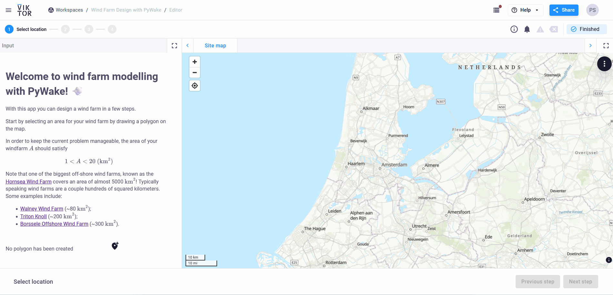
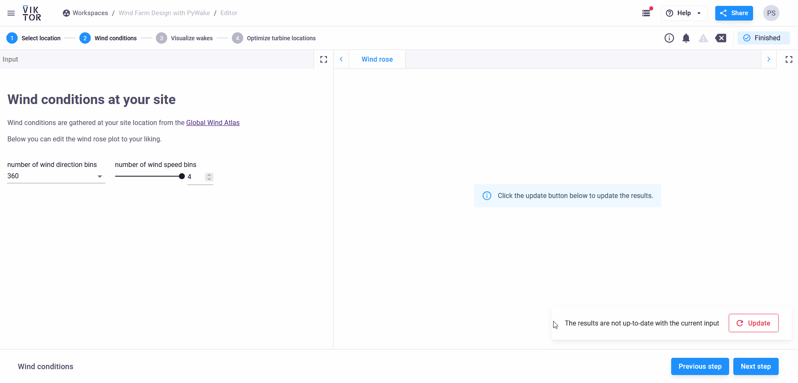

# Wind Farm Design with PyWake
This sample app demonstrates how to optimize wind farm layouts.

The goal of this app is to showcase various analyses and optimizations for wind farm design using VIKTOR. Developed with the help of the open-source libraries [PyWake](https://topfarm.pages.windenergy.dtu.dk/PyWake/) to model-  and [TopFarm](https://topfarm.pages.windenergy.dtu.dk/TopFarm2/) to optimize your custom wind farm

In this application, the following functionalities are demonstrated:
- Defining and visualizing the site boundary on a map.
- Obtaining up-to-date wind distribution data via [Globla Wind Atlas](https://globalwindatlas.info/en) API.
- Simulating and visualizing wind patterns and wake effects.
- Optimizing turbine positions to maximize Annual Energy Production (AEP).
- Displaying detailed results, including wind rose plots, wake plots, and optimized turbine layouts.

A published version of this app is available on [VITKOR's demo environment](https://demo.viktor.ai/public/wind-farm-design-with-pywake)

## Select your own site

Start by selecting an area for your wind farm by drawing a polygon on the map.

In order to keep the current problem manageable, the area of your windfarm A should satisfy
$$
1 < A < 20 (\text{km}^2)
$$

you can view the area of yout current site in 'Wind farm area' output field

## Study the wind conditions at your site

Wind conditions are gathered at your site location from the [Global Wind Atlas](https://globalwindatlas.info/en)

You can edit the wind rose plot to your liking by changing the number of wind direction and/or -speed bins (resolution)

## Visualize wakes and improve your site's layout

Wake effects limit how much energy a wind farm produces. In this step you can try to account for these wake effects in your wind farm.

The goal is to maximize your wind farm's Annual Energy Production (AEP), while using a relatively low number of turbines.

### Wind
Wind direction and -speed will change troughout the course of a year. However, you can get a good idea of what the typical wind conditions will be at your site by studying the wind rose you generated in the 'Wind conditions' step. Try setting the wind direction and -speed to the most common values you gather from the wind rose.

### Turbines
Try to keep the follwing in mind, while designing your wind farm:

- Opting for a bigger turbine increases the energy production per individual turbine, but allows for a lower total number of turbines and increases wake effects;
- Additionally, turbines are typically spaced several multiples of their diameter away from each other. Increasing this spacing reduces wake effects as well as the total number of turbines and AEP.

## Optimize wind turbine positions

Many factors come into play when optmizing your wind farm's layout. The previous step illustrates how this can complicate finding the most efficient and profitable wind farm. Luckily, we can use the Topfarm module to automatically find optimal positions for the wind turbines. This optimization considers the wake effects resulting from the wind conditions at your chosen site.